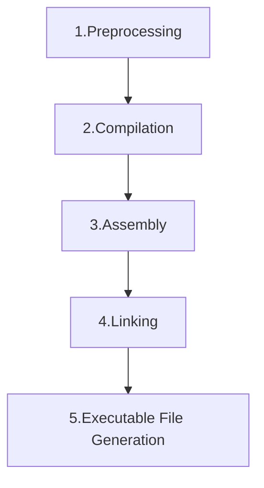

# 編譯流程


編譯過程圖
下面是 C/C++ 編譯過程的簡化流程圖：



編譯過程通常由以下幾個步驟組成：

### 1. **預處理（Preprocessing）**
在編譯過程開始之前，編譯器會執行預處理步驟，這個步驟負責處理宏定義、條件編譯指令和頭文件引入。

**操作內容**：
- 宏替換：將 `#define` 定義的宏替換為具體的值。
- 頭文件插入：將 `#include` 引入的頭文件內容插入源代碼。
- 條件編譯：根據 `#ifdef`、`#endif` 等指令選擇性地包含代碼。

**生成的檔案**：預處理後的代碼文件，通常是 `.i` 或 `.ii` 文件（取決於語言和編譯器）。

```bash
gcc -E my_program.c   # 預處理 C 源文件，生成 .i 文件
g++ -E my_program.cpp # 預處理 C++ 源文件，生成 .ii 文件
```

### 2. **編譯（Compilation）**

此階段編譯器會將展開後的程式碼轉換成組合語言。此階段又可以細分成四個小步驟，分別為 掃描 (scan)、語法分析 (parsing) 、語意分析 (semantic analysis) 與 源代碼優化 (source code optimization) 與 代碼生成與優化(code generation and optimization)。

**操作內容**：
- 程式碼轉換成組合語言（`.s`）

**生成的檔案**：目標文件（如 `my_program.s`）。

```bash
gcc -S my_program.c   # 生成 my_program.s（匯編代碼）
g++ -S my_program.cpp # 生成 my_program.s（匯編代碼）

g++ -S main.i -o main.s
```

### 3. **匯編（Assembly）**

匯編器（assembler）將匯編語言的 .s 文件轉換為 機器代碼，並生成 .o 或 .obj 文件，這些是目標文件，包含了編譯後的機器碼，但尚未進行鏈接。

.o 是目標文件的常見擴展名，特別是在 UNIX/Linux 系統中，而在 Windows 系統中，目標文件的擴展名常見為 .obj。


**操作內容**：
- 將目標文件中的代碼轉換為匯編語言。

**生成的檔案**：匯編文件（如 `my_program.o`）。

```bash
gcc -c my_program.c   # 編譯並生成 my_program.o（目標文件）
g++ -c my_program.cpp # 編譯並生成 my_program.o（目標文件）

g++ -c main.s -o main.o
```


### 4. **鏈接（Linking）**
鏈接器將目標文件和靜態或動態庫文件結合在一起，生成最終的可執行文件。這一步會解析符號並處理代碼和數據重定位。

**操作內容**：
- 將多個目標文件和庫文件結合，解決符號依賴，並生成可執行文件。

**生成的檔案**：最終可執行文件（如 `my_program` 或 `my_program.exe`）。

```bash

將 main.o 連結到 名稱為main的執行檔
$ g++ main.o -o main
```


--

## 靜態鏈接與動態鏈接的區別

### **靜態鏈接（Static Linking）**
靜態鏈接是指在編譯期間，將所有需要的代碼和庫文件（靜態庫）合併進最終的可執行文件中。生成的可執行文件包含了所有的代碼，因此不依賴外部的共享庫。
靜態庫的副檔名通常是 .a（例如 libfoo.a）。在 Windows 系統上，靜態庫的副檔名通常是 .lib（例如 foo.lib）
**特點**：
- **包含所有代碼**：最終的可執行文件包含了所有代碼（包括庫代碼），不需要依賴外部庫。
- **部署簡單**：由於可執行文件包含了所有的代碼，部署時不需要考慮外部庫的依賴。
- **檔案較大**：可執行文件會比動態鏈接的版本大，因為庫代碼被嵌入進去了。
- **更新麻煩**：如果庫有更新，必須重新編譯可執行文件。


### **動態鏈接（Dynamic Linking）**
動態鏈接是指在程式運行時，將外部的共享庫，動態加載到內存中。可執行文件中並不包含庫代碼，而是包含庫的符號鏈接，庫代碼會在運行時加載。
動態庫的副檔名通常是 .so（shared object，例如 libfoo.so）。在 Windows 系統上，動態庫的副檔名是 .dll（例如 foo.dll）

**特點**：
- **小巧的可執行文件**：最終的可執行文件不包含庫代碼，因此比靜態鏈接的版本小。
- **庫共享**：多個應用程式可以共享同一個動態庫，節省內存。
- **更新方便**：動態鏈接庫的更新可以無需重新編譯應用程序，因為應用程式在運行時會使用最新的庫。
- **依賴外部庫**：需要確保運行環境中存在所需的動態庫，否則應用程式無法運行。

**命令示例**：
```bash
gcc -o my_program my_program.o -L/path/to/libs -lfoo 


#gcc：使用 GCC 編譯器。

#-o my_program：指定生成的可執行文件名為 my_program。

#my_program.o：需要鏈接的目標文件，這是已編譯過的源代碼。

#-L/path/to/libs：指定靜態庫的路徑，編譯器會在這個目錄下查找庫文件。

#-lfoo：指定要鏈接的靜態庫，這裡表示鏈接名為 libfoo.a 的靜態庫。注意，這裡使用的是庫名（foo），而不是文件名（libfoo.a）。GCC 會自動在庫名之前加上 lib，並在庫名後加上 .a（在 UNIX/Linux 上）。
```

### 靜態鏈接 和 動態鏈接 同時存在

如果同時存在靜態庫（.a）和動態庫（.so）的情況，gcc 預設會優先選擇 動態庫。這是因為動態庫通常提供更多的靈活性（例如庫的共享和更新），而靜態庫則是將庫代碼嵌入到可執行文件中。

```bash
#強制靜態
gcc -o my_program my_program.o -L/path/to/libs -l:libfoo.a
#強制靜態
gcc -o my_program my_program.o -L/path/to/libs -Wl,-Bdynamic -lfoo

#使用 -L 來指定不同的庫目錄路徑，這樣可以控制 gcc 先搜索哪個目錄。
gcc -o my_program my_program.o -L/path/to/staticlibs -L/path/to/dynamiclibs -lfoo

```
